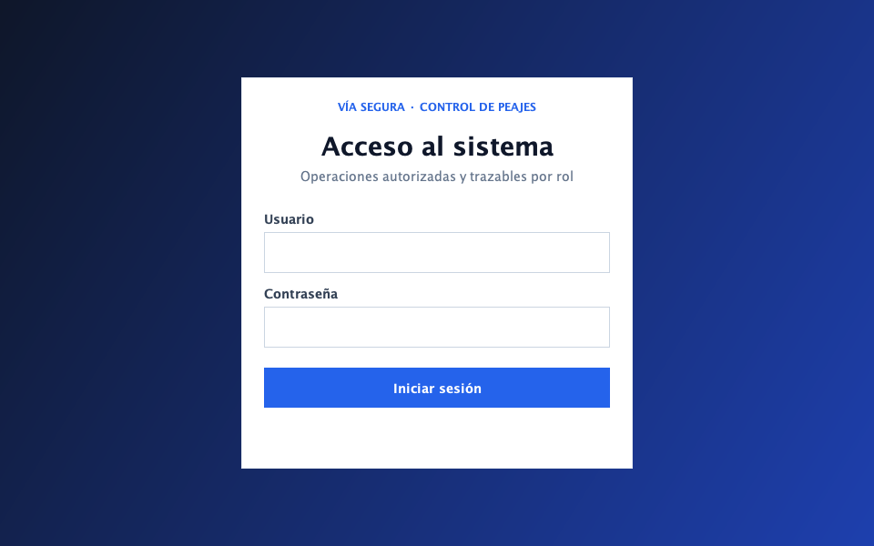
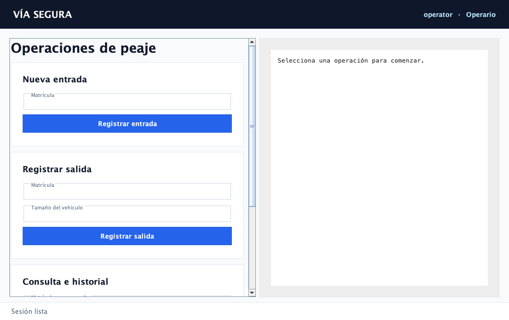
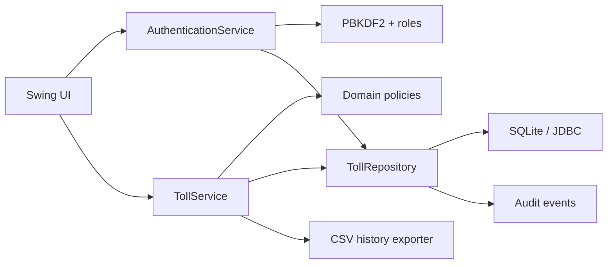

# Java Toll Management System

Aplicación de escritorio para gestionar entradas y salidas de peaje, tickets y multas. Está construida con **Java 17, Swing, SQLite/JDBC, Maven y JUnit 5** siguiendo una arquitectura por capas.

Este repositorio nació como una práctica académica de POO. La versión 2 conserva sus reglas de tarifas, radares y roles, pero sustituye la serialización binaria y el acoplamiento entre formularios y datos por servicios comprobables y persistencia SQL transaccional.





## Qué demuestra

- Java moderno con modelo de dominio inmutable.
- Interfaz desktop Swing sin lógica de negocio embebida.
- Arquitectura `UI → Services → Domain → Repositories → SQLite`.
- JDBC con consultas preparadas y transacciones.
- Autenticación con PBKDF2 y autorización explícita por rol.
- Registro de auditoría para operaciones que modifican estado.
- Validaciones y excepciones centralizadas.
- Logging estructurado con SLF4J y Logback.
- Tests unitarios, de integración SQLite y de autorización con JUnit 5.
- Build reproducible con Maven y CI en Java 17/21.

## Arquitectura



| Capa | Responsabilidad |
| --- | --- |
| `ui` | Presentar formularios, recoger acciones y mostrar resultados/errores. |
| `service` | Casos de uso, límites de autorización, exportación y coordinación transaccional. |
| `domain` | Entidades, tarifas y políticas de radares independientes de Swing/SQL. |
| `validation` | Normalización de matrículas y reglas de entrada centralizadas. |
| `security` | PBKDF2, principal autenticado y autorización por rol. |
| `repository` | Contrato de persistencia e implementación SQLite/JDBC. |
| `bootstrap` | Configuración, migración inicial, composición de dependencias y demo segura. |

El [documento de arquitectura](docs/architecture.md) contiene el UML, el modelo relacional y las decisiones principales.

## Funcionalidades

### Operario

- Registrar entradas y salidas.
- Generar el ticket en la misma transacción que cierra el paso activo.
- Generar automáticamente una multa de tramo cuando corresponda.
- Consultar tickets y multas por matrícula.
- Exportar el historial en CSV.
- Consultar los últimos eventos de auditoría.

### Agente

- Evaluar detecciones de radar móvil.
- Registrar multas solo cuando se supera el límite.
- Consultar multas por matrícula.

### Conductor

- Consultar únicamente los tickets y multas de su matrícula asociada.
- Pagar multas pendientes una sola vez.

Las autorizaciones se aplican en `TollService`, no solo ocultando botones. Una llamada directa desde otra interfaz recibe igualmente `UnauthorizedOperationException`.

## Ejecutar

Requisitos: JDK 17+ y Maven 3.9+.

```bash
mvn clean verify
mvn exec:java -Dexec.mainClass=com.revyalo.toll.TollApplication
```

También se genera un JAR con todas las dependencias:

```bash
mvn package
java -jar target/java-toll-management-system-2.0.0-SNAPSHOT-all.jar
```

Comprobación no gráfica útil para despliegues y CI:

```bash
TOLL_DB_PATH=/tmp/tolls-check.db \
  java -jar target/java-toll-management-system-2.0.0-SNAPSHOT-all.jar --health-check
```

En el primer arranque se crea `data/tolls.db`, se ejecuta el esquema y se añaden cuentas puramente demostrativas:

| Usuario | Contraseña | Rol | Matrícula |
| --- | --- | --- | --- |
| `operator` | `demo1234` | Operario | — |
| `agent` | `demo1234` | Agente | — |
| `driver` | `demo1234` | Conductor | `1234ABC` |

Estas credenciales están pensadas exclusivamente para una demo local. Las contraseñas se almacenan con PBKDF2-HMAC-SHA256, sal aleatoria y 120.000 iteraciones, nunca en texto plano.

Para elegir otra base de datos:

```bash
TOLL_DB_PATH=/ruta/privada/peajes.db \
  mvn exec:java -Dexec.mainClass=com.revyalo.toll.TollApplication
```

También puede usarse `-Dtoll.db.path=/ruta/peajes.db`.

## Persistencia

SQLite mantiene tablas separadas para:

- usuarios y roles;
- pasos actualmente abiertos;
- tickets finalizados;
- multas y estado de pago;
- eventos de auditoría.

Las salidas eliminan el paso activo y crean ticket/multa dentro de una única transacción. Las matrículas nunca se concatenan en SQL: todos los valores entran mediante `PreparedStatement`.

La versión 2 no deserializa `peajes.dat`. La deserialización Java de objetos no confiables introduce riesgos y acopla el formato a las clases; SQLite ofrece un esquema inspeccionable, migrable y consultable.

## Tests

```bash
mvn test
```

La suite cubre:

- todas las franjas de tarifa y límites de tamaño;
- radar móvil, radar de tramo y velocidad límite;
- matrículas, tamaños, fechas y entradas maliciosas;
- persistencia tras reabrir SQLite;
- atomicidad de entrada/salida/ticket/multa;
- pagos únicos y auditoría;
- autenticación correcta/incorrecta;
- permisos de operario, agente y conductor;
- consultas restringidas por matrícula;
- exportación CSV;
- inicialización completa del contexto de aplicación.

GitHub Actions ejecuta `mvn verify` con Temurin 17 y 21.

## Logging y datos runtime

Los logs rotan en `data/logs/` mediante Logback. La base SQLite, logs y exportaciones se excluyen de Git. Los datos incluidos por el inicializador son ficticios.

## Evolución del proyecto

El UML, las notas y el vídeo de la primera versión se conservan como material histórico en `docs/legacy-uml.pdf`, `docs/legacy-notes.txt` y `media/legacy-demo-pruebas.mp4`. El historial Git permite comparar directamente la práctica original con la versión por capas.
