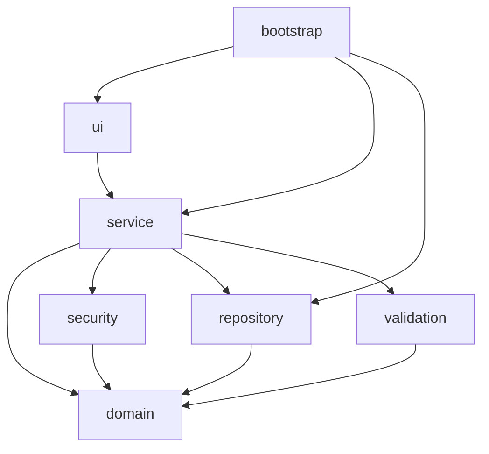
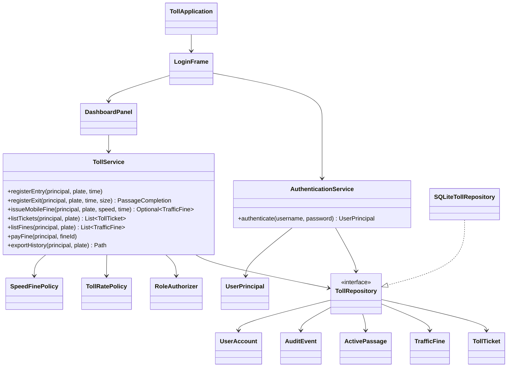
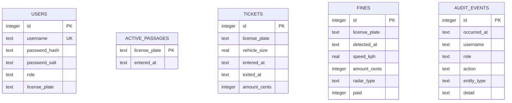

# Arquitectura y UML

## Dependencias

La regla principal es que las capas interiores no conocen Swing ni SQLite:

## Diagrama de clases principal

## Modelo relacional

Los importes se almacenan como céntimos enteros para evitar errores de coma flotante. Las fechas se guardan en ISO-8601 y se convierten a `LocalDateTime` en el borde JDBC.

## Decisiones relevantes

- **SQLite en lugar de serialización:** esquema explícito, transacciones, consultas preparadas e inspección con herramientas estándar.
- **Repositorio como interfaz:** los servicios no dependen de JDBC y pueden probarse con una base temporal.
- **Autorización en servicios:** la UI no constituye una frontera de seguridad fiable.
- **Políticas puras:** tarifas y radares no conocen persistencia ni interfaz, por lo que sus límites se prueban directamente.
- **Composición manual:** el proyecto es suficientemente pequeño para evitar un framework de inyección; `ApplicationContext` hace explícito el cableado.
- **Swing sin Spring Boot:** conserva variedad tecnológica dentro del portfolio y no introduce un servidor innecesario.
